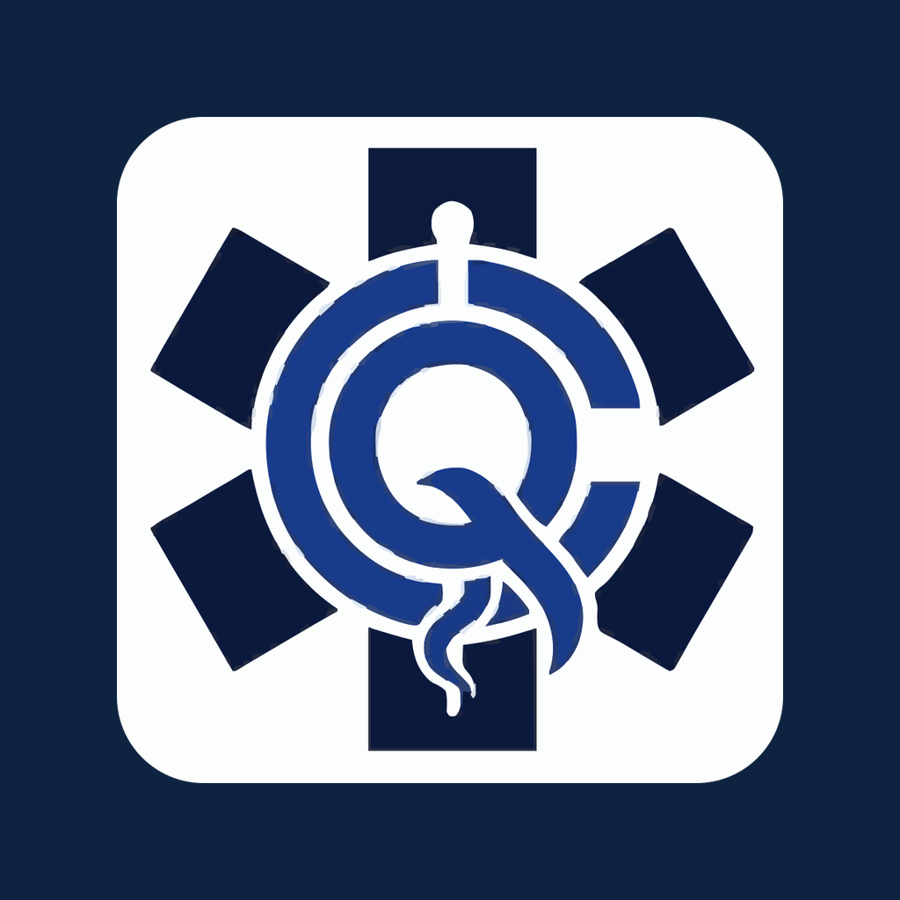

<div align="center">



# QELCare Patient — Mobile App

**The patient-facing companion app for the QELCare clinic platform — native Android & iOS builds that let patients book appointments, view medical records, manage medications, and scan lab results, all from one React + Capacitor codebase.**

[](https://capacitorjs.com/)
[](https://react.dev/)
[](https://vitejs.dev/)
[](#building-the-apps)
[](https://reactrouter.com/)

</div>

---

## Overview

**QELCare Patient** is the mobile client for [QELCare](https://github.com/acpilla/qelcareWebsite), a multispecialty clinic management platform. It packages the patient portion of the web application into native **Android** and **iOS** apps using [Capacitor](https://capacitorjs.com/), talking to the same Node/Express + PostgreSQL backend the clinic staff use.

Rather than maintaining a separate mobile codebase, the app **reuses the web app's React components as-is** — a small custom Vite plugin compiles the existing `.js` files as JSX, so a single component library powers both web and mobile. The mobile entrypoint then strips out every staff, admin, and public-display route, hardens the app for patient-only use, and adapts navigation and routing for a native WebView.

## Key Features

### For patients
- **Appointment booking & history** — browse doctors by specialty, book visits, and track upcoming and past appointments.
- **Medical & health records** — read-only access to consultation records, vitals, and health history.
- **Medications** — view prescribed medications in one place.
- **Lab & medical results with OCR** — capture with the camera or upload a file (image or PDF); PDFs are rendered in-app with **pdf.js**, and document text is extracted through the backend OCR endpoint.
- **Self-service account** — patient registration, OTP email verification, and forgot-password reset flows.
- **Profile with OTP-gated edits** — changing username, email, phone, or address requires a fresh one-time code.

### Mobile engineering highlights
- **Single shared component library** — a custom Vite transform (`js-as-jsx`) lets the mobile build consume the web app's `.js` React components without renaming or forking them.
- **Patient-only by construction** — all staff/admin/queue/landing routes are removed from the mobile entrypoint, and login rejects any non-`Patient` account.
- **WebView-safe routing** — uses `HashRouter` so deep refreshes inside the Android/iOS WebView never break navigation.
- **Idle auto-logout** — an inactivity timer signs patients out automatically, important for shared devices.
- **Notch-aware, mobile-first UI** — `viewport-fit=cover` with safe-area insets and a dedicated responsive stylesheet; navigation is a slide-out drawer.
- **No-Mac iOS pipeline** — a GitHub Actions workflow builds an unsigned iOS IPA on a macOS runner, so the app can be produced and sideloaded **without a Mac or a paid Apple Developer account** (see [Building the apps](#building-the-apps)).
- **Configurable backend** — the API base URL is injected at build time via `VITE_API_URL` (with a `REACT_APP_API_URL` alias for parity with the web app).

## Tech Stack

| Area | Technologies |
|---|---|
| **App shell** | [Capacitor 8](https://capacitorjs.com/) (`@capacitor/core`, `@capacitor/android`, `@capacitor/ios`, `@capacitor/app`) |
| **UI** | React 18, React Router v7 (`HashRouter`), hand-built responsive CSS (no UI framework) |
| **Build tooling** | Vite 7, `@vitejs/plugin-react`, a custom `.js`-as-JSX transform, `@capacitor/assets` for icon/splash generation |
| **Documents** | `pdfjs-dist` (in-app PDF rendering) + backend OCR for text extraction |
| **CI / Distribution** | GitHub Actions (macOS runner → unsigned IPA artifact); Android APK via Gradle |
| **Backend** | Shared [QELCare](https://github.com/acpilla/qelcareWebsite) Node/Express + PostgreSQL API |

## What's Inside

<details>
<summary><strong>Screens & structure</strong></summary>

```
src/
├── App.js                         # HashRouter + patient-only route map
├── index.jsx                      # App entrypoint
├── components/
│   ├── Login/LoginScreen.js       # Login (blocks non-Patient accounts)
│   ├── Register/RegisterScreen.js # Patient self-registration
│   ├── ForgotPassword/            # Forgot-password flow
│   ├── Verifications/             # OTP email verification / password reset
│   ├── UserSide/
│   │   ├── UserScreen.js          # Dashboard
│   │   ├── UserBooking.js         # Book an appointment
│   │   ├── PatientAppointments.js # Upcoming & past appointments
│   │   ├── MedicalRecords.js      # Consultation records
│   │   ├── HealthRecords.js       # Health history
│   │   ├── MedicationScreen.js    # Medications
│   │   ├── PatientResults.js      # Lab/medical results + OCR upload
│   │   └── ProfileScreen.js       # Profile with OTP-gated edits
│   ├── Layout/MainLayout.js       # Drawer navigation + shell
│   ├── Layout/NotificationBell.js
│   ├── Auth/PatientIdleTimeout.js # Inactivity auto-logout
│   └── Workflow/ClinicUi.js       # Shared UI kit
└── utils/                         # auth.js, roleAccess.js

android/                           # Capacitor Android platform
assets/                            # App icon + splash source images
.github/workflows/build-ios.yml    # Unsigned-IPA CI pipeline
capacitor.config.json              # appId: com.qelcare.patient
vite.config.js                     # Vite config + js-as-jsx plugin
```
</details>

## Getting Started

### Prerequisites
- **Node.js 22+** and npm — required by the Capacitor 8 CLI.
- A running **QELCare backend** with patient endpoints enabled (see [Backend requirement](#backend-requirement)).
- For Android builds: **Android Studio** + Android SDK.
- For iOS builds: a Mac with Xcode **or** just this repo's GitHub Actions workflow (no Mac needed).

### 1. Install
```bash
npm install
```

### 2. Configure the backend URL
```bash
cp .env.example .env
```
Set `VITE_API_URL` to point at your backend:

| Scenario | Value |
|---|---|
| Android emulator → backend on your machine | `http://10.0.2.2:5001` |
| Real phone / installed app | `https://your-qelcare-backend.example.com` (deployed HTTPS) |

> On a real phone, **never use `localhost`** — it resolves to the phone itself, not your development machine.

### 3. Run as a web app (fastest dev loop)
```bash
npm run dev      # Vite dev server on http://localhost:3000
```

## Building the Apps

### Android
```bash
# Build web assets, sync into the native project, and assemble a debug APK
npm run apk:debug
# → android/app/build/outputs/apk/debug/app-debug.apk
```
For a release build (requires your own signing key):
```bash
npm run apk:release
```
Or open the project in Android Studio to run on a device/emulator:
```bash
npm run cap:sync:android
npm run cap:open:android
```

### iOS — no Mac required
The [`build-ios.yml`](.github/workflows/build-ios.yml) GitHub Actions workflow produces a distributable iOS app **without a local Mac or a paid Apple Developer account**:

1. On every push to `main` (or a manual run), a **macOS runner** builds the Vite assets, generates the iOS project fresh (`cap add ios` → `cap sync ios`), and brands the icon and splash from `assets/`.
2. It injects the required `Info.plist` usage strings (camera, photo library) and App Transport Security settings.
3. It compiles an **unsigned** `.app`, packages it as `QELCarePatient-unsigned.ipa`, and uploads it as a build artifact.
4. Download the artifact and sign/install it on your device with **[Sideloadly](https://sideloadly.io/)** using a free Apple ID.

## Backend Requirement

The app is a client for the shared **[QELCare backend](https://github.com/acpilla/qelcareWebsite)** and expects the patient self-service auth endpoints to be mounted at `/auth/patient/*` (patient registration, OTP verification, and profile updates), in addition to the core patient data endpoints.

<details>
<summary><strong>Endpoints the app calls</strong></summary>

**Authentication**
- `POST /auth/login`, `POST /auth/logout`
- `POST /auth/otp/send` · `POST /auth/otp/verify` · `POST /auth/otp/resend`
- `POST /auth/password/reset`

**Patient self-service** (`/auth/patient/*`)
- `POST /auth/patient/register` · `/register/verify` · `/register/resend`
- `POST /auth/patient/profile/otp` · `/profile/otp/check`
- `PUT  /auth/patient/profile`

**Patient data**
- `GET /users/me` · `GET /users/doctors` · `GET /patients/me`
- `GET /appointments/me` · `POST /appointments/book`
- `GET /medical-records/me` · `GET /vitals/me`
- `GET /patient-results/me` · `POST /patient-results` · `POST /patient-results/ocr` · `PATCH` / `DELETE /patient-results/:id`
</details>

## Configuration

| Variable | Description |
|---|---|
| `VITE_API_URL` | Base URL of the QELCare backend (no trailing slash). Baked into the build. |
| `REACT_APP_API_URL` | Optional alias, mapped by `vite.config.js` so shared web components work unchanged. |

For installed builds, the committed `.env.production` supplies the backend URL that ships with the release.

## Related

- **[QELCare Web Platform](https://github.com/acpilla/qelcareWebsite)** — the full clinic management system (staff + patient web app, backend, and database) this app connects to.

## License

No open-source license has been declared for this repository, so all rights are reserved by the author by default. Please contact the maintainer before reusing the code.

## Contact

Built and maintained by **[@acpilla](https://github.com/acpilla)** · [Repository](https://github.com/acpilla/QElCare-Mobile-Patient)
